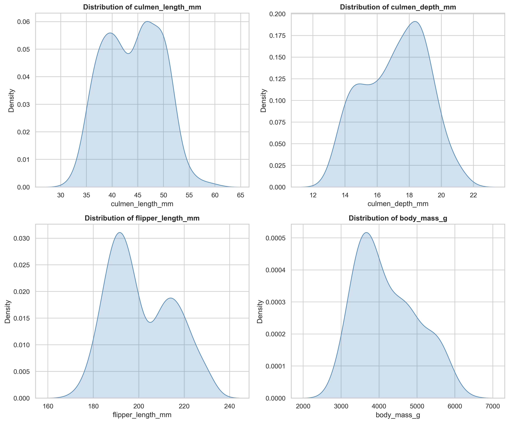
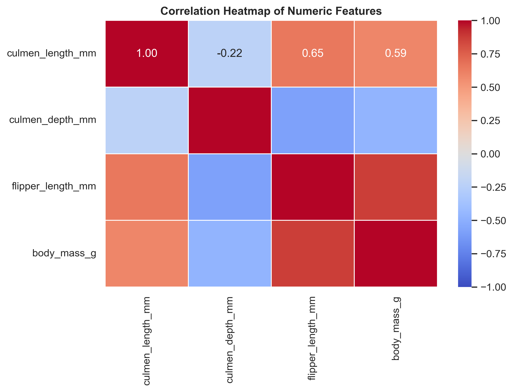
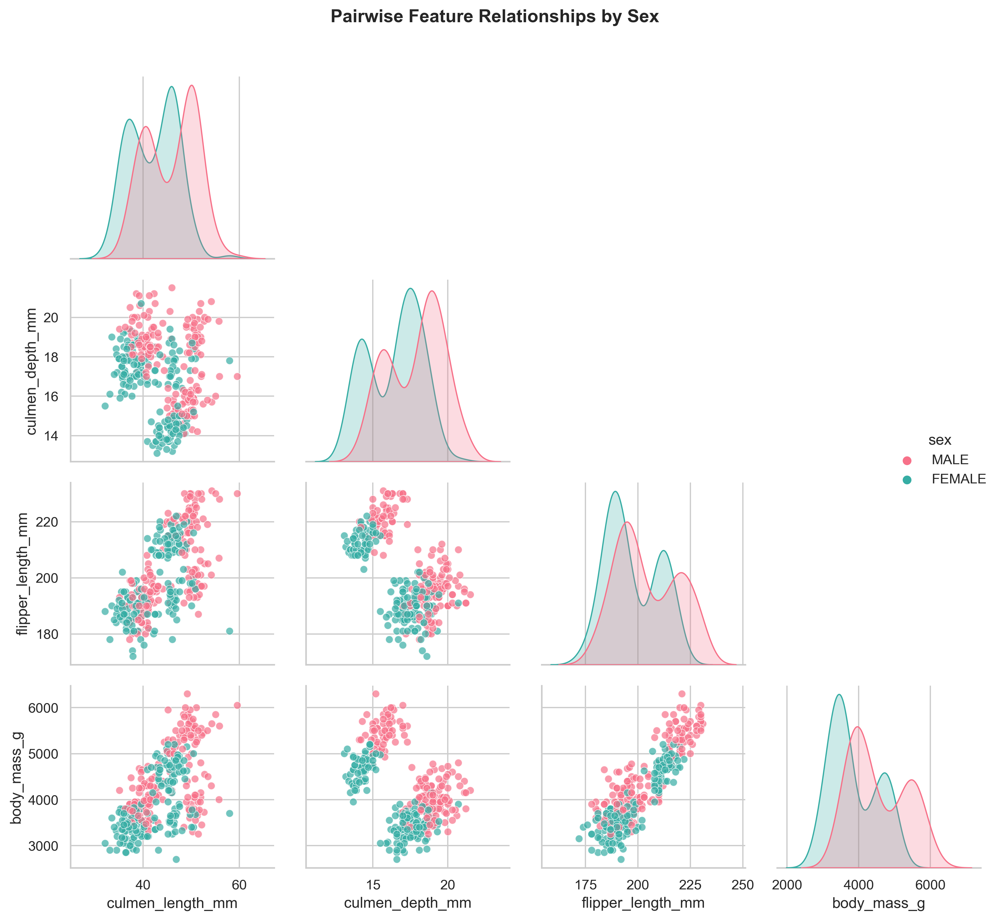
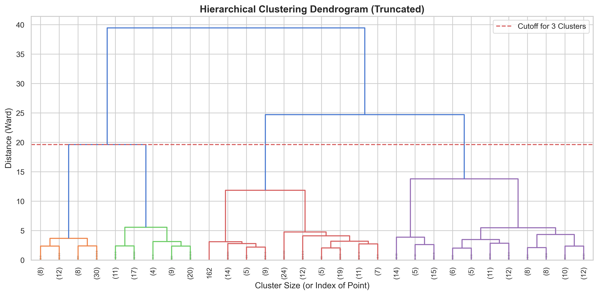
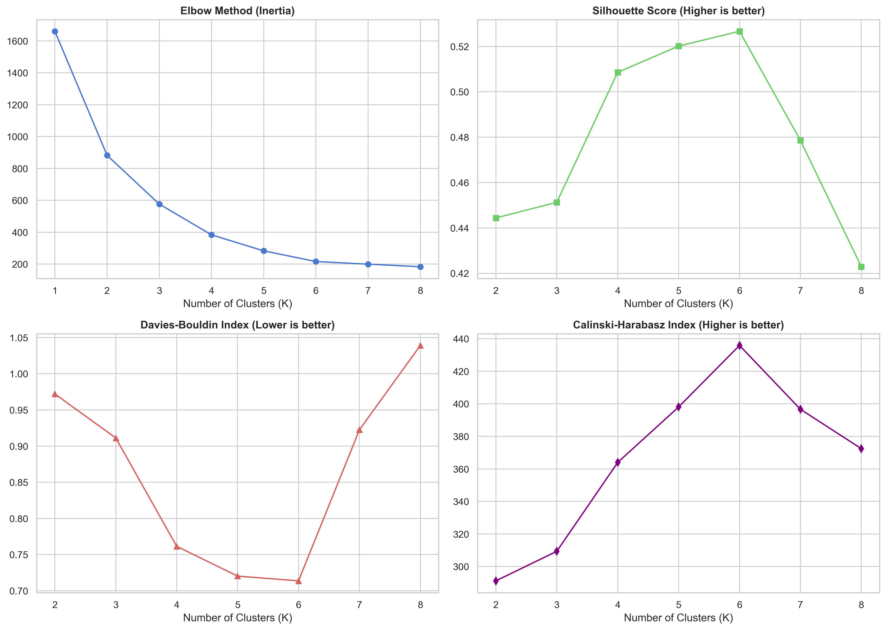
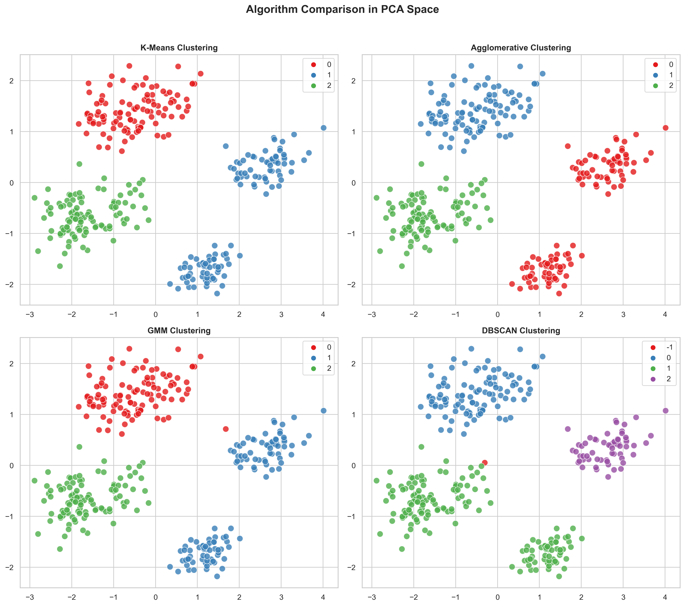
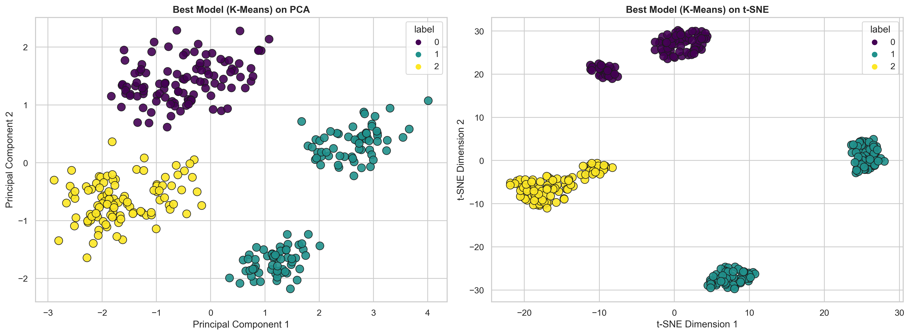
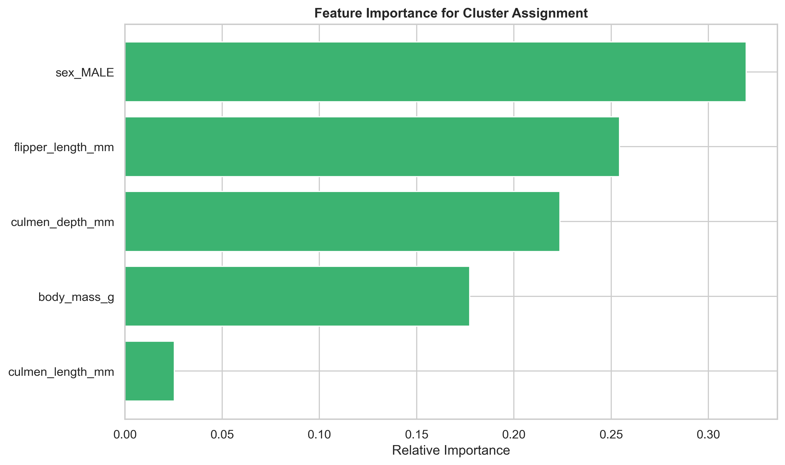
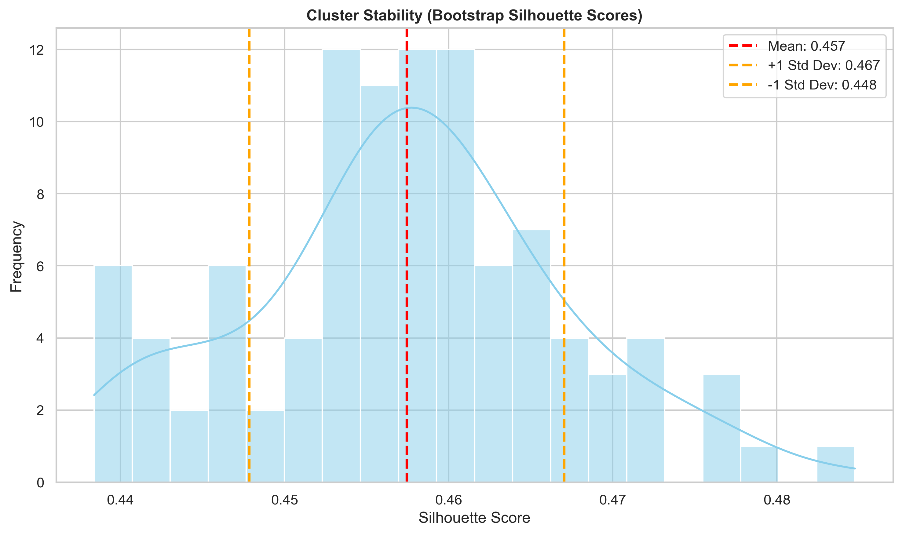

# 🐧 Penguin Species Clustering: An Unsupervised Machine Learning Analysis


## 📋 Project Overview
This project provides a comprehensive, end-to-end unsupervised machine learning pipeline to cluster Palmer Penguins based on physical measurements. It evaluates multiple clustering algorithms (K-Means, Agglomerative, Gaussian Mixture Models, DBSCAN), utilizes dimensionality reduction (PCA, t-SNE), and rigorously validates the results using composite scoring, bootstrapping, and ANOVA testing to discover distinct species groupings without prior labels.

---

## ♟️Table of Contents
- [Required Libraries](#required-libraries)
- [Project Structure](#project-structure)
- [Installation and Setup](#installation-and-setup)
- [Usage](#usage)
- [Analysis and Key Findings](#analysis-and-key-findings)
  - [Exploratory Data Analysis (EDA)](#exploratory-data-analysis-eda)
  - [Dimensionality Reduction & Hierarchical Clustering](#dimensionality-reduction--hierarchical-clustering)
  - [Algorithm Evaluation & Selection](#algorithm-evaluation--selection)
  - [Best Model Profiling & Feature Importance](#best-model-profiling--feature-importance)
  - [Statistical Validation & Stability](#statistical-validation--stability)
- [Technical Decisions and Rationale](#technical-decisions-and-rationale)
- [Challenges and Solutions](#challenges-and-solutions)
- [Future Work and Improvements](#future-work-and-improvements)
- [License](#license)
- [About the Author](#about-the-author)

---

## 🛠️ Required Libraries
This project relies on the following core Python libraries:
* **Python**: Version 3.8+
* **NumPy**: For numerical matrix operations. `pip install numpy`
* **Pandas**: For tabular data manipulation. `pip install pandas`
* **Matplotlib**: For foundational plotting. `pip install matplotlib`
* **Seaborn**: For aesthetic statistical visualizations. `pip install seaborn`
* **Scikit-learn**: For clustering algorithms, metrics, and PCA/t-SNE. `pip install scikit-learn`
* **SciPy**: For hierarchical dendrograms and ANOVA testing. `pip install scipy`
* **Jupyter**: For interactive data exploration and analysis. `pip install jupyter`

---

## 📁 Project Structure
```
penguin-clustering/
├── data/
│   └── penguins.csv              # The raw Palmer Penguins dataset
├── notebooks/
│   ├── cluster_analysis.ipynb    # Complete analysis notebook
│   └── cluster_analysis.py       # Script for automated analysis
├── images/                       # Output folder for generated visualizations
│   ├── penguins_distributions.png
│   ├── penguins_correlation.png
│   ├── penguins_pairplot.png
│   ├── penguins_dendogram.png
│   ├── penguins_evaluation_metrics.png
│   ├── penguins_model_comparison.png
│   ├── penguins_best_model.png
│   ├── penguins_feature_importance.png
│   ├── penguins_cluster_stability.png
├── README.md                     # This documentation file
└── requirements.txt              # Dependency list
```

---

## 🚀 Installation and Setup

### Prerequisites
Ensure Python 3.8+ and `pip` are installed on your system.

### Steps
1. **Clone the repository:**
   ```bash
   git clone https://github.com/your-username/penguin-clustering.git
   cd penguin-clustering
   ```

2. **Create and activate a virtual environment:**
   * Windows: `python -m venv venv && .\venv\Scripts\activate`
   * macOS/Linux: `python -m venv venv && source venv/bin/activate`

3. **Install dependencies:**
   ```bash
   pip install -r requirements.txt
   ```

---

## 📊 Usage
The entire pipeline is contained within a single cohesive script/notebook. Open `notebooks/clustering_pipeline.ipynb` in Jupyter Notebook or JupyterLab and run all cells sequentially to reproduce the data cleaning, model training, composite scoring, and visualization generation.

---

## 📈 Analysis and Key Findings 🏆 

### Exploratory Data Analysis (EDA)
The dataset was first cleaned by coercing errors and dropping missing values. We analyzed the distributions and correlations of the four numeric features: `culmen_length_mm`, `culmen_depth_mm`, `flipper_length_mm`, and `body_mass_g`.

**Key Findings:**
* Bimodal distributions in flipper length and body mass strongly suggested the presence of distinct sub-populations.
* High positive correlation (0.87) observed between flipper length and body mass.


*Figure 1: KDE distributions showing bimodal shapes hinting at distinct clusters.*


*Figure 2: Heatmap showing strong correlations between physical traits.*


*Figure 3: Pairplot revealing that while sex accounts for variance, deeper structural groupings exist.*

### Dimensionality Reduction & Hierarchical Clustering
To visualize the multi-dimensional space, we applied Principal Component Analysis (PCA) and t-Distributed Stochastic Neighbor Embedding (t-SNE). A Hierarchical Dendrogram was generated using Ward's linkage.

**Key Findings:**
* The dendrogram clearly indicated a highly optimal split at $k=3$ clusters, aligning with the domain knowledge of three native penguin species (Adelie, Chinstrap, Gentoo).


*Figure 4: Dendrogram visually confirming 3 distinct macro-clusters.*

### Algorithm Evaluation & Selection
Four algorithms were tested: K-Means, Agglomerative Clustering, Gaussian Mixture Models (GMM), and DBSCAN. They were evaluated across a range of $k$ values using Inertia, Silhouette Score, Davies-Bouldin Index, and Calinski-Harabasz Index.

**Key Findings:**
* The metrics charts unanimously pointed to $k=6$ as the mathematical optimum, suggesting an internal clustering of the 3 known species further into 2 based on their sex (3 x 2 = 6). 
* A dynamic Composite Scoring system (min-max scaling of the three primary metrics) was implemented to rank the algorithms objectively.


*Figure 5: Metric curves suggesting k=6 to be optimal number of clusters.*


*Figure 6: Scatter plots showing how different algorithms partition the PCA space.*

### Best Model Profiling & Feature Importance
The highest-scoring model was automatically selected and projected onto both PCA and t-SNE spaces. To understand *why* the clusters formed, a Random Forest classifier was trained on the cluster labels to extract feature importances.


*Figure 7: Final cluster assignments mapped on reduced dimensional spaces.*


*Figure 8: Flipper length and culmen length drove the majority of the clustering decisions.*

### Statistical Validation & Stability
Machine learning outputs require statistical backing. We utilized bootstrapping (resampling 100 times) to prove cluster stability and ANOVA testing to prove significant variance.

**Key Findings:**
* **Stability:** The bootstrapped Silhouette score showed a tight standard deviation, proving the clusters are highly stable and not artifacts of random initialization.
* **Significance:** One-way ANOVA tests across all features returned p-values near zero ($< 10^{-26}$), proving that the physical profiles of the 3 clusters are statistically distinct.


*Figure 9: Distribution of Silhouette scores across 100 resampled datasets.*

---

## 📝 Technical Decisions and Rationale
* **Standardization:** `StandardScaler` was essential. Distance-based algorithms (like K-Means) fail if features (like body mass vs. culmen length) are on drastically different numeric scales.
* **Composite Scoring:** Instead of subjectively choosing K-Means, we implemented a scaled composite score averaging Silhouette, Calinski-Harabasz, and (inverted) Davies-Bouldin scores to mathematically declare a winner.
* **Random Forest for Unsupervised Insight:** Clustering models don't provide native feature importance. Using an embedded Random Forest to predict the cluster labels is a robust industry workaround to achieve interpretability.

---

## 💡 Challenges and Solutions
* **Challenge:** DBSCAN frequently classified data as noise (`-1`) or grouped everything into a single cluster, crashing the metric evaluations.
* **Solution:** Programmatic error handling was added. If an algorithm returned $<2$ valid clusters, its metrics were assigned `NaN` and it was cleanly disqualified in the composite scoring phase.

---

## 👤 Author

#### GitHub: [@PRSPrithvi](https://github.com/PRSPrithvi)
#### LinkedIn: [Prithvi Raj Singh](https://www.linkedin.com/in/prithvi-raj-singh-b91247235)
#### Email: prithvi020536@gmail.com

---

## 🙏 Acknowledgments

- Dataset source: DataCamp (Clustering Antartic Penguin Species)
- Allison Horst for the dataset and project idea
- Thanks to the scikit-learn community for excellent documentation

---

## 📚 References

1. Scikit-learn Documentation: https://scikit-learn.org/
2. Pandas Documentation: https://pandas.pydata.org/docs/user_guide/index.html
3. Seaborn Documentation: https://seaborn.pydata.org/
4. DataCamp: https://projects.datacamp.com/projects/1809

---

## ⭐ Star This Repository

If you found this project helpful, please consider giving it a star! It helps others discover this work, as well as me to improve my reach.
